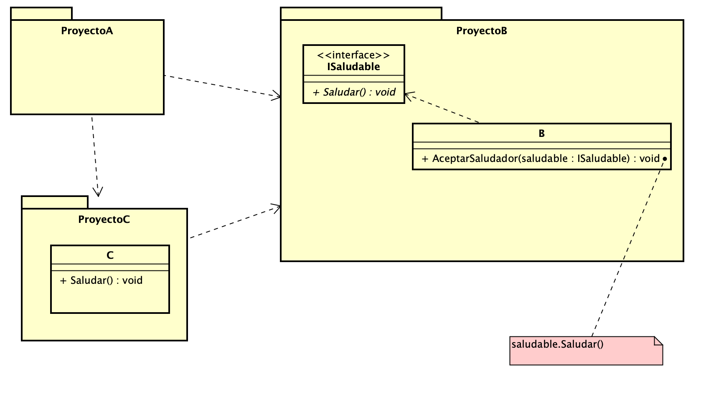

# Clase 22/03/2021

## Ejemplo Dependencia-Polimorfismo

Observar como con Polimorfismo podemos ejecutar código del que no dependemos.

En el **ProyectoA** vemos como **B** llama al método _Saludar()_ de **C** pese a que no existe una dependencia del **ProyectoB** hacia **ProyectoC** (la dependencia es inversa). Es decir, el sentido de la dependencia es inverso al del flujo de ejecución.

## Ejemplo Herencia-Composición Delegación

Analizar como el Cuadrado reutiliza el método _CalcularArea()_ del Rectángulo primero
* Heredando de él
* Delegando el comportamiento a el
